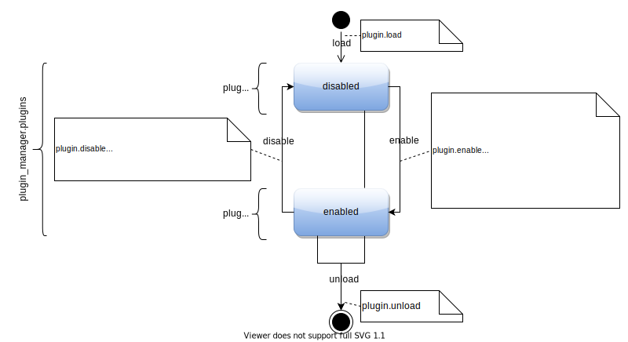

# Lifecycle {: #plugin-guide.lifecycle }

There are three sources of installed plugins that OctoPrint will check during start up:

- its own `octoprint/plugins` folder (this is where the bundled plugins reside),
- the `plugins` folder in its configuration directory (e.g. `~/.octoprint/plugins` on Linux),
- any Python packages registered for the entry point `octoprint.plugin`.

Each plugin that OctoPrint finds it will first load, then enable. On enabling a plugin, OctoPrint will
register its declared [hook handlers][plugin-guide.hooks] and [helpers][plugin-guide.helpers], apply
any [settings overlays][plugin-guide.control-properties.settings-overlays],
[inject the required properties][plugin-guide.injected-properties] into its declared
[mixin implementation][plugin-guide.mixins] and register those as well.

On disabling a plugin, its hook handlers, helpers, mixin implementations and settings 
overlays will be de-registered again.

When a plugin gets enabled, OctoPrint will also call the 
[`on_plugin_enabled`][octoprint.plugin.core.Plugin.on_plugin_enabled] callback on its 
implementation (if it exists). Likewise, when a plugin gets disabled OctoPrint will call 
the  [`on_plugin_disabled`][octoprint.plugin.core.Plugin.on_plugin_disabled] callback on
its implementation (again, if it exists).

Some plugin types require a reload of the frontend or a restart of OctoPrint for 
enabling/disabling them. You can recognize such plugins by their implementations 
implementing [octoprint.plugin.types.ReloadNeedingPlugin][] or
[octoprint.plugin.types.RestartNeedingPlugin][], or providing handlers for one of the 
hooks marked correspondingly. For these plugins, disabling them will *not* trigger the 
respective callback at runtime as they will not actually be disabled right away but only 
marked as such so that they won't even load during the required restart.

Note that uninstalling a plugin through the bundled Plugin Manager will make a plugin first get disabled and
then unloaded, but only if it doesn't require a restart. Plugins wishing to react to an uninstall through the
Plugin Manager may implement [`on_plugin_pending_uninstall`][octoprint.plugin.types.OctoPrintPlugin.on_plugin_pending_uninstall]
(added in OctoPrint 1.8.0) which will always be called by the Plugin Manager,
regardless of whether the plugin requires a restart of OctoPrint to be fully uninstalled or not. Please be aware
that the Plugin Manager is not the only way to uninstall a plugin from the system, a user may also uninstall it
manually through the command line, circumventing Plugin Manager completely.

<figure markdown>

</figure>
